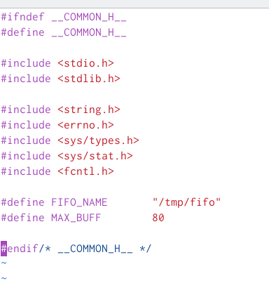

**РОССИЙСКИЙ УНИВЕРСИТЕТ ДРУЖБЫ НАРОДОВ**

` `**Факультет физико-математических и естественных наук**

` `**Фундаментальная Информатика и Информационные технологии**

**ОТЧЕТ** 

**ПО ЛАБОРАТОРНОЙ РАБОТЕ № 14**

*дисциплина:*	*операционные системы*

Узор-Ежикеме Чинечелум А.

` `НФИбд-03-21

` `1032215263 

**Цель работы**

Приобретение практических навыков работы с именованными каналами.

**Последовательность выполнения работы**

\1. Работает не 1 клиент, а несколько (например, два).

\2. Клиенты передают текущее время с некоторой периодичностью (например, раз в пять

секунд). Используйте функцию sleep() для приостановки работы клиента.

\3. Сервер работает не бесконечно, а прекращает работу через некоторое время (например, 30 сек). Используйте функцию clock() для определения времени работы сервера.

Что будет в случае, если сервер завершит работу, не закрыв канал?

Взяв примеры в примечаниях в качестве образца, я написал аналогичные программы, внеся следующие изменения:

- Работает не 1 клиент, а несколько.

- Клиенты передают текущее время с некоторой периодичностью

Создал makefile:

**Контрольные вопросы**

\1. В чем ключевое отличие именованных каналов от неименованных?

\- 

\2. Возможно ли создание неименованного канала из командной строки?

\- Да, возможно

\3. Возможно ли создание именованного канала из командной строки?

\- Да, возможно

\4. Опишите функцию языка С, создающую неименованный канал.

\- Для того, чтобы создать неназванный канал, используется функция, вызывающая т.е. pipe().

\5. Опишите функцию языка С, создающую именованный канал.

\- Для создания файла FIFO/именованного канала используется функция, вызываемая, например, *mkfifo.*

\6. Что будет в случае прочтения из fifo меньшего числа байтов, чем находится в канале?

Большего числа байтов?

\- Нет, меньшее числа байтов.

\7. Аналогично, что будет в случае записи в fifo меньшего числа байтов, чем позволяет буфер? Большего числа байтов?

\- Да.

\8. Могут ли два и более процессов читать или записывать в канал?
\- Да, несколько процессов могут считывать данные из канала (или записывать в него)

\9. Опишите функцию strerror.

\- Функция strerror() возвращает указатель на строку, которая описывает код ошибки, переданный в аргументе errnum, возможно, используя часть LC\_MESSAGES текущей локали для выбора соответствующего языка.

