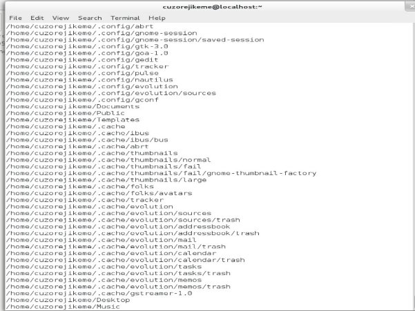
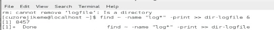

**РОССИЙСКИЙ УНИВЕРСИТЕТ ДРУЖБЫ НАРОДОВ**

` `**Факультет физико-математических и естественных наук**

` `**Фундаментальная Информатика и Информационные технологии**

**ОТЧЕТ** 

**ПО ЛАБОРАТОРНОЙ РАБОТЕ № 6**

*дисциплина:*	*операционные системы*

Узор-Ежикеме Чинечелум А.

` `НФИбд-03-21

` `1032215263 

- Запись в файл file.txt имена файлов, содержащихся в каталоге /etc. Добавил имена файлов, содержащихся в моем домашнем каталоге, в тот же файл.

- Вывел имена всех файлов из file.txt , имеющий расширение .conf, затем записал их в новый текстовый файл conf.txt

- Определил файлы в моем домашнем каталоге, имена которых начинаются с символа c.

- Отображаются имена файлов из каталога /etc, начинающиеся с символа h.

- Запустил процесс в фоновом режиме, который записывал файлы, имена которых начинаются с log, в файл ~/logfile. Удалил файл ~/logfile.

- Запустил редактор gedit из консоли в фоновом режиме.

- Определил идентификатор процесса gedit с помощью команды ps, конвейера и фильтра grep. Другим способом определения идентификатора процесса является использование команды *ps aux*.

- Использовал команду kill для завершения процесса gedit.

- Выполнил команды df и du.

- Вывел имена всех каталогов, доступных в моем домашнем каталоге, с помощью команды find

**Контрольные вопросы**

\1. Какие потоки ввода вывода вы знаете?

\- stdin — стандартный поток ввода (по умолчанию: клавиатура), файловый дескриптор 0;

stdout — стандартный поток вывода (по умолчанию: консоль), файловый дескриптор 1;

stderr — стандартный поток вывод сообщений об ошибках (по умолчанию: консоль), файловый дескриптор 2.

\2. Объясните разницу между операцией > и >>.

\- Оба оператора часто используются для изменения файлов в Linux. “>” - это оператор вывода, который перезаписывает существующий файл, в то время как “>>” также является оператором вывода, но добавляет данные в уже существующий файл.

\3. Что такое конвейер?

\- Конвейер - это форма перенаправления, которая используется для отправки выходных данных одной команды / программы /процесса другой команде /программе / процессу для дальнейшей обработки.

\4. Что такое процесс? Чем это понятие отличается от программы?

\- Процесс - это любой активный (запущенный) экземпляр программы. Но программа - это всего лишь исполняемый файл, хранящийся в хранилище на компьютере.

\5. Что такое PID и GID?

\- PID - Идентификатор процесса

`  `GID - Идентификатор группы

\6. Что такое задачи и какая команда позволяет ими управлять?

\- Задача - это базовая единица программирования, которой управляет операционная система. Для управления им используется команда kill.

\7. Найдите информацию об утилитах top и htop. Каковы их функции?

\- Команда top используется для отображения процессов Linux. htop Command - это утилита командной строки, которая позволяет пользователю интерактивно отслеживать жизненно важные ресурсы системы или процессы сервера в режиме реального времени.

\8. Назовите и дайте характеристику команде поиска файлов. Приведите примеры использования этой команды.

\- Команда find используется для поиска файлов. Он также может быть использован для присвоения имен определенным файлам в соответствии с параметрами, введенными пользователем. Пример,

\9. Можно ли по контексту (содержанию) найти файл? Если да, то как?

-Команда find используется для присвоения имен определенным файлам в соответствии с параметрами, введенными пользователем.

\10. Как определить объем свободной памяти на жёстком диске?

\- Команда df используется для определения свободной памяти на жестком диске.

\11. Как определить объем вашего домашнего каталога?

\- Объем домашнего каталога можно определить с помощью команды du.

\12. Как удалить зависший процесс?

\- С помощью команды kill.

