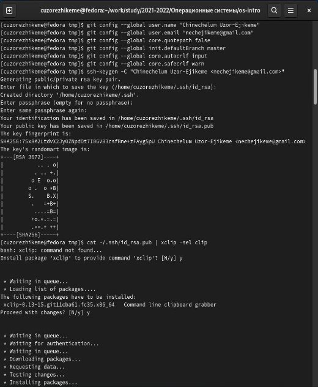

**РОССИЙСКИЙ УНИВЕРСИТЕТ ДРУЖБЫ** 

**НАРОДОВ** 

` `**Факультет физико-математических и естественных наук** 

` `**Фундаментальная Информатика и Информационные технологии** 
**

**ОТЧЕТ**  

**ПО ЛАБОРАТОРНОЙ РАБОТЕ № 2** 
**

***дисциплина:* *Операционные системы*** 
\*

\*

Узор-Ежикеме Чинечелум А. 

` `НФИбд-03-21 

` `1032215263  

#
# **Задание**  
1. Создать базовую конфигурацию для работы с git.  
1. Создать ключ SSH.  
1. Создать ключ PGP.  
1. Настроить подписи git.  
1. Зарегистрироваться на Github.  
1. Создать локальный каталог для выполнения заданий по предмету. 

# **Ответы Настройка github** 
Создали учётную запись на https://github.com и Заполнили основные данные на [https://github.com]()[.](https://github.com/) 

 

**

**

**

**

**

**

**

**Установка gh в Fedora Linux** 
**

** 
**

**

**

**

**Базовая настройка git** 

- Установленный имя и отправлено по электронной почте мой репозиторий, настроен utf-8 при выводе сообщений git, настроил проверку и подписание git commit, установил имя начальной ветки, параметр autocrlf и параметр safecrlf. 

**Создайте ключи ssh** 

- Использовался алгоритм rsa с размером ключа 4096 бит и алгоритм ed25519 
**

** 
**

** 
**

# **Создайте ключи pgp** 
– Сгенерировать ключ 

 

**

**

**

**

**

**

**

**

**

**

**

**

# **Добавление PGP ключа в GitHub** 
** 

** 
**

** 
**

# **Настройка автоматических подписей коммитов git** 
Используется для указания git использовать адрес электронной почты, введенный при подписании коммитов. 

 

# **Настройка gh** 
После входа в систему утилита задаст несколько наводящих вопросов, и пользователь войдет в систему через браузер. 
# **Сознание репозитория курса на основе шаблона** 

 
**

**

**

**

**

**

**

**

**

**

**

**

# **Настройка каталога курса** 
** 

**  

