**РОССИЙСКИЙ УНИВЕРСИТЕТ ДРУЖБЫ НАРОДОВ**

` `**Факультет физико-математических и естественных наук**

` `**Фундаментальная Информатика и Информационные технологии**

**ОТЧЕТ** 

**ПО ЛАБОРАТОРНОЙ РАБОТЕ № 4**

# ***дисциплина:*	*Операционные Системы***

Узор-Ежикеме Чинечелум А.

` `НФИбд-03-21

` `1032215263 

**Последовательность выполнения работы**

1. Определено полное имя домашнего каталога.

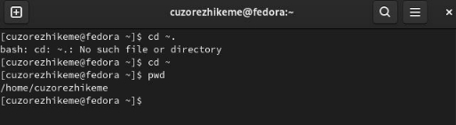

1. Зашел в каталог /tmp, использовал команду ls для отображения содержимого каталога /tmp. Определено, что в каталоге /var/spool нет подкаталога с именем 'cron'. Отобразил содержимое домашнего каталога и определил владельца файлов и подкаталогов.

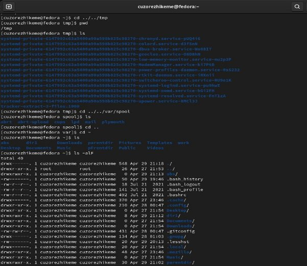

1. Создал новый каталог "newdir" в домашнем каталоге. Создал еще один новый каталог "morefun" в каталоге "newdir". Создал еще несколько новых каталогов "письма", "заметки" и "misk" с помощью одной команды *mkdir* удалил их. Удалил "newdir" с помощью команды *rm*. Установлено, что оно было удалено. Пытался удалить "morefun" отдельно, но он уже был удален с помощью "newdir", потому что это подкаталог каталога "newdir".

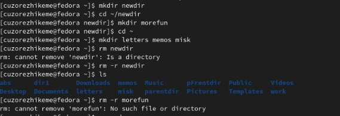

1. Использовал команду man, чтобы определить, что параметр *-R* команды *ls* используется для просмотра содержимого не только указанного каталога, но и подкаталогов.

1. Использовал команду man, чтобы определить, что параметр *-t* команды *ls* используется для сортировки по времени последнего изменения в выходном списке содержимого каталога.

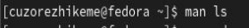

1. Использовал команду *man* для просмотра описания команды *cd*, команды *pwd* и команды mkdir.

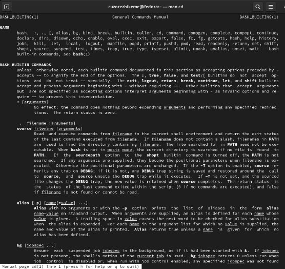

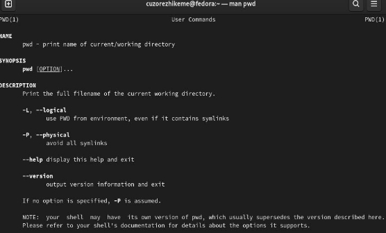

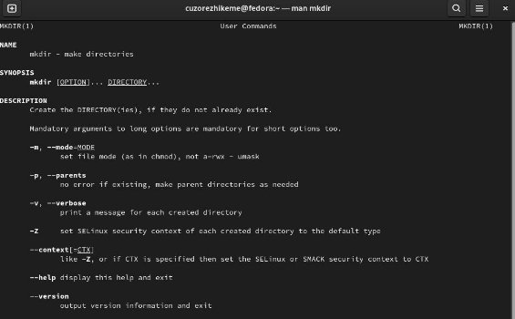

1. Выполнил модификацию и выполнение нескольких команд с помощью команды *history*.

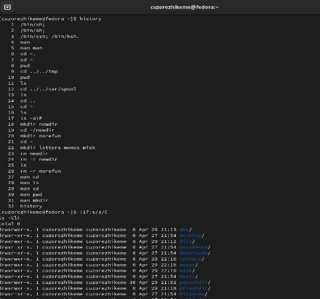

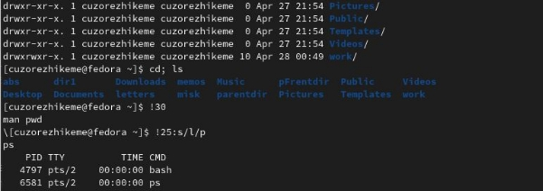

**Контрольные вопросы**

\1. Что такое командная строка?

-Командная строка, также называемая командной строкой Windows, командным экраном или тестовым интерфейсом, представляет собой пользовательский интерфейс, навигация по которому осуществляется путем ввода команд в подсказках вместо использования мыши.

\2. При помощи какой команды можно определить абсолютный путь текущего каталога?

Приведите пример.

-то *pwd* команда используется для определения пути к указанному каталогу.  чтобы определить путь к текущему каталогу, мы используем *cd* команда для указания текущего каталога перед использованием *pwd* команда, так как таким образом,

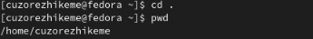

\3. При помощи какой команды и каких опций можно определить только тип файлов

и их имена в текущем каталоге? Приведите примеры.

-Мы используем команду *ls* для определения содержимого каталога списка. мы используем функцию *l* для определения типа файлов и имен в каталоге, например,

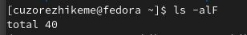

\4. Каким образом отобразить информацию о скрытых файлах? Приведите примеры.

\- Мы используем команду *ls* для определения содержимого каталога списка. мы используем функцию A для определения скрытых файлов в каталоге, например,

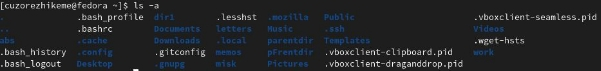

\5. При помощи каких команд можно удалить файл и каталог? Можно ли это сделать

одной и той же командой? Приведите примеры.

\- Мы можем использовать команду *rm* для удаления файла или каталога, или и того, и другого. Например,

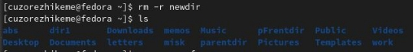

\6. Каким образом можно вывести информацию о последних выполненных пользователем командах? работы?

\- Мы можем получить информацию о последней команде, выполненной пользователем, с помощью *history* команда.

\7. Как воспользоваться историей команд для их модифицированного выполнения? Приведите примеры.

\- Мы можем использовать историю команд для их измененного выполнения, используя их серийный номер, чтобы ввести команду, подобную этой,

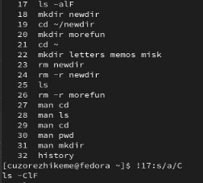

\8. Приведите примеры запуска нескольких команд в одной строке.

\- Если требуется выполнить последовательно несколько команд, записанный в одной строке, то для этого используется символ точка с запятой. Пример:

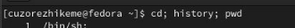

\9. Дайте определение и приведите примера символов экранирования.

\- Экранирующий символ - это символ, который вызывает альтернативную интерпретацию следующих символов в последовательности символов. например, обратная связь(\\), знак доллара (\$) и двойная кавычка(\").

\10. Охарактеризуйте вывод информации на экран после выполнения команды ls с опцией l.

\- После выполнения команды ls с

параметром l отображается подробная информация о файлах и каталогах. Будет отображена информация о типе файла, праве доступа, количестве ссылок, владельце, размере, дате последней ревизии и имени каждого файла и каталога.

\11. Что такое относительный путь к файлу? Приведите примеры использования относительного и абсолютного пути при выполнении какой-либо команды.

-Относительный путь - это иерархический путь, который определяет местоположение файла или папки в файловой системе, начиная с текущего каталога. Относительный путь отличается от абсолютного пути, который определяет местоположение файла или папки, начиная с корня файловой системы.

\12. Как получить информацию об интересующей вас команде?

-С помощью *man* команда

